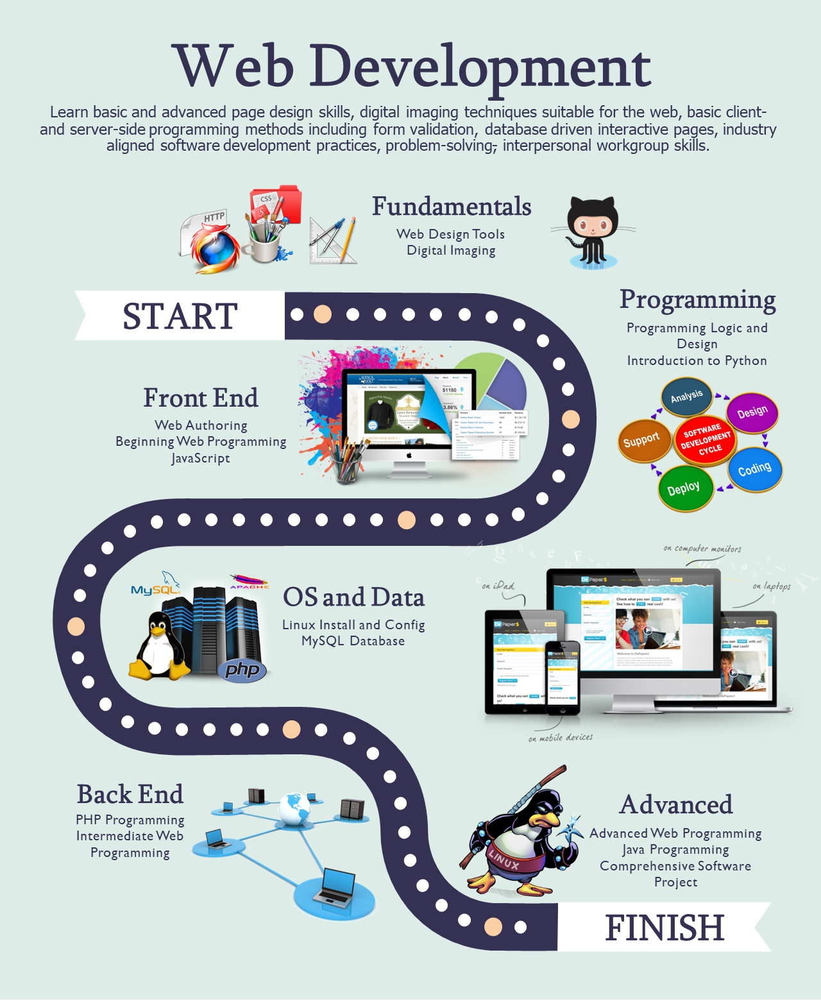

# 👋 Hi, I’m Stephen Herd

I’m an educator, developer, and systems designer with more than three decades of experience building and teaching technical solutions that connect people, tools, and learning. My work bridges hands-on automotive education and modern web development — from early training systems for General Motors to custom learning-management platforms used in college-level web and programming courses.

---

### 💡 What I Do
- Design and build custom **learning management systems** using PHP, Laravel, Tailwind CSS, and MySQL  
- Create **accessible, real-world instructional content** for web development and applied technology  
- Integrate **AI-enhanced teaching methods** to help learners and educators work smarter  
- Develop open-source **tools and resources** that make technical education more human and practical

---

### 🛠️ Technologies & Tools
**Languages:** PHP, JavaScript, SQL, HTML, CSS  
**Frameworks:** Laravel, Tailwind CSS, React (introductory), Bootstrap  
**Tools:** VS Code, Git, GitHub, XAMPP, MySQL Workbench, Node.js  
**Special Interests:** Accessibility, Open-Source Education, AI in Instructional Design

---

### 🚀 Current Project
- **[My Web Training](https://mywebtraining.net):** A custom Laravel-based LMS delivering nine structured web development courses  

---

### 🌎 Connect
- 🌐 [LinkedIn](https://www.linkedin.com/in/sherd/)  
- 💻 [My Web Training](https://mywebtraining.net)  
- 🧰 [GitHub Repositories](https://github.com/mywebtraining)  
- ✉️ **webmaster@mywebtraining.net**

---

> “Technology should amplify human potential, not replace it.”  
> — Stephen Herd

All of the public repos are available for free use. Please use them with care as they are not created for comercial use. This is for educational purposes only.

<!--
**bhc-webdev/bhc-webdev** is a ✨ _special_ ✨ repository because its `README.md` (this file) appears on your GitHub profile.

Here are some ideas to get you started:

- 🔭 I’m currently working on ...
- 🌱 I’m currently learning ...
- 👯 I’m looking to collaborate on ...
- 🤔 I’m looking for help with ...
- 💬 Ask me about ...
- 📫 How to reach me: ...
- 😄 Pronouns: ...
- ⚡ Fun fact: ...
-->
